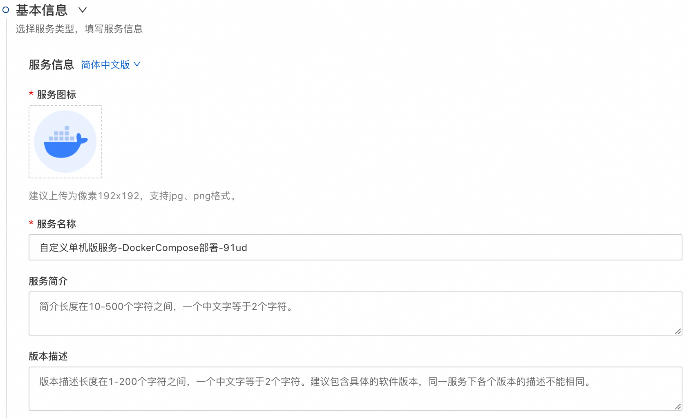
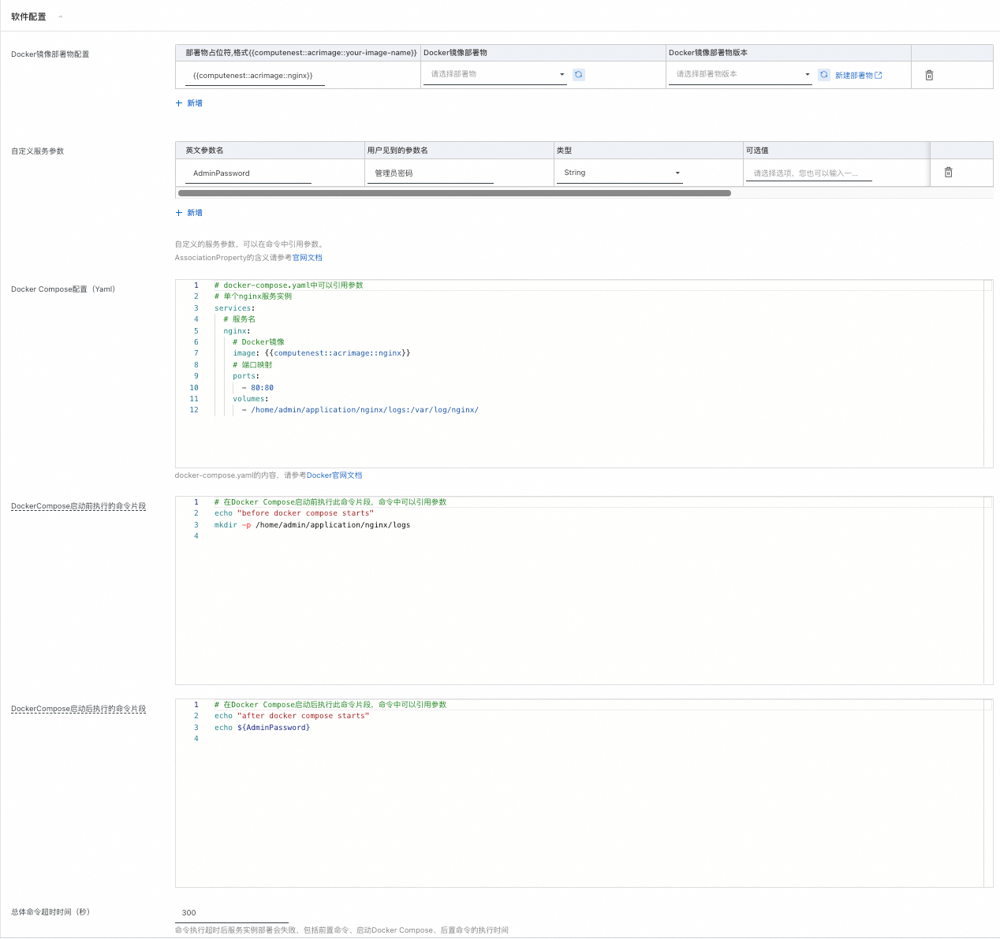
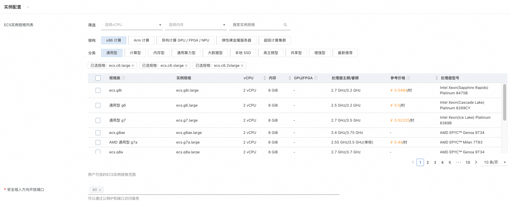
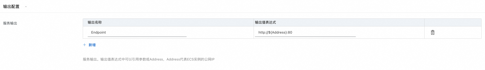

# 服务模板说明文档

## 服务模板说明

本文介绍基于Docker Compose的单机ECS服务模板，本示例对应的Git仓库地址：[quickstart-docker-compose](https://github.com/aliyun-computenest/quickstart-docker-compose)

本示例会自动地构建计算巢服务，具体的服务构建流程为
1. 服务商提前按需创建好一个或多个容器镜像部署物，参考[官网文档](https://help.aliyun.com/zh/compute-nest/manage-container-images)。
2. 选择此服务模板创建计算巢服务，关联容器镜像部署物，定制docker-compose.yaml和前置、后置命令，定制服务入参和输出。
3. 提交后自动创建服务，创建过程大约需要2分钟，创建成功后服务变成待预发布状态。

## 服务部署架构

此服务模板构建出的服务的部署架构为单机ecs部署。

## 计费说明
通过此服务模板构建服务不产生费用。  
用户部署构建出的服务时，资源费用主要涉及：
- 所选ECS实例规格
- 磁盘容量
- 公网带宽

计费方式包括：
- 按量付费（小时）
- 包年包月

预估费用在部署前可实时看到。

## RAM账号所需权限

此服务模板构建出的服务需要对ECS、VPC等资源进行访问和创建操作，若使用RAM用户创建服务实例，需要在创建服务实例前，对使用的RAM用户的账号添加相应资源的权限。添加RAM权限的详细操作，请参见[为RAM用户授权](https://help.aliyun.com/document_detail/121945.html)。所需权限如下表所示：

| 权限策略名称                              | 备注                            |
|-------------------------------------|-------------------------------|
| AliyunECSFullAccess                 | 管理云服务器服务（ECS）的权限              |
| AliyunVPCFullAccess                 | 管理专有网络（VPC）的权限                |
| AliyunROSFullAccess                 | 管理资源编排服务（ROS）的权限              |
| AliyunComputeNestUserFullAccess     | 管理计算巢服务（ComputeNest）的用户侧权限    |
| AliyunComputeNestSupplierFullAccess | 管理计算巢服务（ComputeNest）的服务商侧权限 ｜ |

### 自定义服务配置
本服务模板支持服务商自定义服务配置。在通用场景的基础上对软件的参数和服务的输出进行配置。 
在服务创建完成后，服务商可以进行编辑定制。

本服务模板支持服务商指定以下信息：

|配置组| 配置项                          | 说明                                                             |
|---------|---------------------------------|----------------------------------------------------------------|
|服务信息| 服务图标             | 服务图标。                                                          |
|服务信息| 服务名称             | 服务名称。                                                          |
|服务信息| 服务简介             | 服务简介。                                                          |
|服务信息| 版本描述             | 初始版本的版本描述。                                                     |
|软件配置| Docker镜像部署物列表             | Docker镜像部署物和部署物版本。在DockerCompose配置文件中可以引用部署物占位符作为docker image。 |
|软件配置| 自定义服务参数             | 服务商自定义的入参，用户在创建服务实例时可见。可以在DockerCompose配置、命令和服务输出中引用入参。        |
|软件配置| DockerCompose配置             | docker-compose.yaml的内容。                                        |
|软件配置| DockerCompose启动前执行的命令片段             | DockerCompose启动前执行的命令片段。                                       |
|软件配置|DockerCompose启动后执行的命令片段             | DockerCompose启动后执行的命令片段。                                       |
|软件配置| 总体命令超时时间             | 命令执行超时后服务实例部署会失败，包括前置命令、启动DockerCompose、后置命令的执行时间。             |
|实例配置| ECS实例规格列表             | 用户可选的ECS实例规格范围。                                                |
|实例配置| 安全组开放端口             | 安全组开放的的入方向端口列表，可以在开发的端口上提供服务。                                  |
|输出配置| 服务输出 | 服务的输出配置，服务实例部署成功后用户可以在服务实例详情中看到输出信息。                           |

## 服务构建流程
1. 填写服务的基本信息 。

2. 填写软件配置。

3. 填写ECS实例配置。

4. 填写服务输出配置。

5. 点击创建服务，等待服务构建完成。构建完成后您可以尝试创建服务实例或者对服务配置进行修改。

## 服务配置

[创建代运维服务完成实例运维](https://help.aliyun.com/zh/compute-nest/create-a-hosted-operations-and-maintenance-service?spm=a2c4g.11186623.0.i24#task-2167552])

[创建包含变配功能的服务](https://help.aliyun.com/zh/compute-nest/use-cases/create-a-service-that-supports-specification-changes-and-change-the-specifications-of-a-service-instance?spm=a2c4g.11186623.0.i3])

[创建包含服务升级功能的服务](https://help.aliyun.com/zh/compute-nest/upgrade-a-service-instance?spm=a2c4g.11186623.0.i17#task-2236803)

## 服务交付

[自定义服务架构图](https://help.aliyun.com/zh/compute-nest/customize-a-service-architecture?spm=a2c4g.11186623.0.0.56e736bfyUdlFm])

[服务文档上线流程](https://help.aliyun.com/zh/compute-nest/use-cases/publish-documents-to-compute-nest?spm=a2c4g.313309.0.i0])

[将服务上架云市场并上到云市场售卖](https://help.aliyun.com/zh/compute-nest/publish-a-service-to-alibaba-cloud-marketplace?spm=a2c4g.11186623.0.i7])

## 其他说明

[实例代码源地址](https://atomgit.com/flow-example/spring-boot)

[软件包package.tgz构建流程参考](https://help.aliyun.com/document_detail/153848.html)
